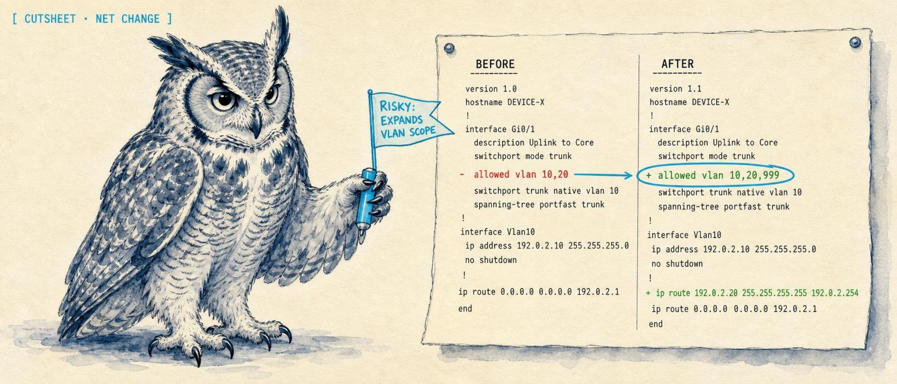
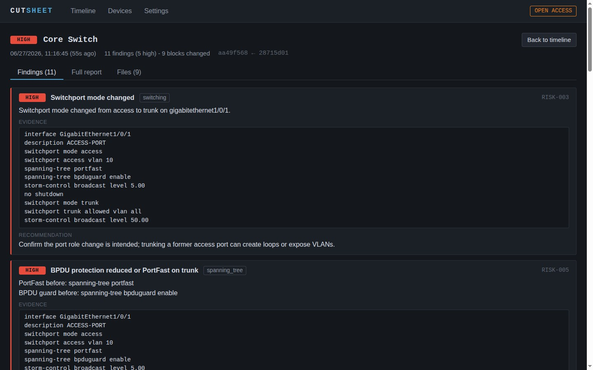

<p align="center">
  
</p>

<h1 align="center">Cutsheet</h1>

<p align="center">
  <strong>Network change intelligence: it watches your device configs and tells you what changed and whether you should be worried.</strong>
</p>

<p align="center">
  <a href="https://cutsheet.dev"><strong>cutsheet.dev</strong></a>
</p>

<p align="center">
  
  
  
</p>

Cutsheet is config-backup tooling with a brain. Tools like Oxidized and RANCID archive your switch, router, and firewall configs and hand you a raw text diff; Cutsheet keeps the same git-backed history and then runs every change through a deterministic risk analyzer, so instead of a wall of colored lines you get findings like "trunk now carries all VLANs" or "firewall rule broadened to any/any". Everything runs in a single binary on your own hardware: no agent installs, no cloud, and it never pushes config to a device.

<!-- TODO: screenshot of the web UI change timeline -->

## What it does

Cutsheet is network change management and config diff intelligence for NetOps and on-call engineers. It polls your switches, gateways, firewalls, and UniFi controllers on a schedule, keeps every config snapshot in a git-backed history, and runs each change through an offline risk analyzer that understands VLANs, trunks, spanning tree, ACLs, and firewall rules. Each detected change becomes a timeline entry with risk findings, a rollback plan, a validation plan, and an operator checklist you can actually hand to whoever is on call. It supports Cisco IOS/IOS XE, Ubiquiti EdgeSwitch and EdgeOS/VyOS, Palo Alto PAN-OS, Juniper Junos, Fortinet FortiOS, UniFi controllers, eero networks, and a generic fallback for everything else. Collectors are read-only and credentials are encrypted at rest, so the worst Cutsheet can do to a device is read its config.

## Quick start (Docker)

```bash
git clone https://github.com/solomonneas/cutsheet.git
cd cutsheet
docker compose up -d --build
```

Create an API token (required in Docker, see note below):

```bash
docker compose exec cutsheet cutsheet token create --data-dir /data --name admin
```

Open http://localhost:8633, paste the token in Settings, and add your first device.

> **Why the token is required in Docker:** Cutsheet allows tokenless requests
> from localhost only while zero tokens exist, as a first-run convenience.
> Inside Docker, your browser's requests arrive through the published port and
> reach the container from the Docker bridge network, not loopback, so that
> allowance never applies. Create one token and use it; that also closes the
> tokenless door entirely.

The compose file binds the port to `127.0.0.1` on the host. To reach Cutsheet
from other machines, change the port mapping to `"8633:8633"` after you have
created a token.

### Without Docker

```bash
go build -o cutsheet ./cmd/cutsheet
./cutsheet serve --data-dir ./data
```

The server listens on `127.0.0.1:8633` by default and works tokenless from
the same machine until you create a token with `cutsheet token create`.

## Try it with zero hardware

Demo mode seeds a data directory with four sample devices (Cisco Catalyst
switch, EdgeOS gateway, UniFi controller, FortiGate firewall) and replays a
realistic config change on each, so the timeline shows real risk-analyzed
changes immediately:

```bash
./cutsheet demo --data-dir ./demo-data
./cutsheet serve --data-dir ./demo-data
# open http://localhost:8633
```

That seeds real analyzed changes from lab-safe fixtures:

```
Seeded demo data: 4 devices, 8 changes, 31 risk findings.

Next steps:
  cutsheet serve --data-dir ./demo-data
  open http://127.0.0.1:8633
```

Or in Docker, before the volume has any data in it:

```bash
docker compose run --rm cutsheet demo --data-dir /data
docker compose up -d
```

Demo mode refuses to touch a non-empty data directory, so it can never
clobber real monitoring data.

## What a finding looks like

<p align="center">
  
</p>

The headline feature is the deterministic risk analysis, not the diff. Run a
config change through the offline CLI (or let the server do it on every poll)
and you get findings written in operator language. From the bundled Catalyst
demo fixtures (`cutsheet-cli explain --vendor cisco-ios`), one of the eleven
findings on that change:

```
## RISK-004 - Trunk carries all VLANs

- Severity: `medium`
- Category: `switching`
- Recommendation: Prune the trunk to required VLANs; carrying all VLANs widens the L2 fault and security domain.
- Details:
  - Trunk on gigabitethernet1/0/1 now allows all VLANs.
- Evidence:
  - `interface GigabitEthernet1/0/1`
  - `switchport mode access`     # before
  - `switchport mode trunk`      # after
  - `switchport trunk allowed vlan all`
```

The same change also raises a `high` finding because a former access port is
now a trunk (`RISK-003 - Switchport mode changed`), a VTP mode change, and a
spanning-tree mode change. Severity is computed from the parsed config, not
from line counts.

## Adding real devices

Collectors are read-only: they run `show`-style commands or call read APIs.
Cutsheet never writes to a device.

SSH device (EdgeOS example; presets exist for `edgeos`, `vyos`, `cisco-ios`,
`junos`, `fortios`):

```bash
cutsheet device add --data-dir ./data \
  --id branch-gw1 --name "Branch Gateway" --address 192.0.2.1 \
  --collector ssh \
  --config '{"host":"192.0.2.1","username":"audit","password":"REDACTED","preset":"edgeos","host_key":"ssh-ed25519 AAAA..."}' \
  --interval 300
```

UniFi controller:

```bash
cutsheet device add --data-dir ./data \
  --id campus-unifi --name "Campus Controller" --address 192.0.2.20 \
  --collector unifi \
  --config '{"url":"https://192.0.2.20","username":"audit","password":"REDACTED","site":"default"}'
```

Eero network (unofficial cloud API, the one the mobile app uses):

```bash
cutsheet device add --data-dir ./data \
  --id home-eero --name "Home Mesh" --address api-user.e2ro.com \
  --collector eero \
  --config '{"session_token":"REDACTED","network_id":"1234567"}'
```

Cutsheet does not run eero's OTP login flow (login, SMS/email code, verify).
Obtain a session token out of band, for example with
[eero-cli](https://github.com/solomonneas/eero-cli) (`eero auth`), and paste
it as `session_token`. Tokens from that flow are long-lived (about 30 days)
and carry no refresh token, so there is no transparent refresh: when the API
returns 401, re-authenticate and update `session_token`. `network_id` is
optional when the account has exactly one network; with several, the error
message lists them. Snapshots are a deterministic JSON document (network
settings, nodes, profiles, port forwards, reservations) diffed by the
generic analyzer.

Notes:

- Passwords and private keys are encrypted at rest (NaCl secretbox) the
  moment the device is added. Set `CUTSHEET_SECRET_KEY` (64 hex chars) to
  control the key yourself; otherwise one is generated at
  `<data-dir>/secret.key` with owner-only permissions.
- SSH host keys are verified against the configured `host_key`. Skipping
  verification requires an explicit `"insecure_ignore_host_key": true`.
- `--interval` is the poll interval in seconds (`0` = manual snapshots
  only). You can also trigger a snapshot any time from the UI or with
  `POST /api/v1/devices/{id}/snapshot`.
- Devices can equally be managed through the web UI or the REST API.

## Notifications

Cutsheet can push every analyzed change to a generic webhook (JSON POST) and
to Discord, filtered by severity:

```bash
cutsheet serve --data-dir ./data \
  --webhook-url https://example.com/hook \
  --discord-webhook-url https://discord.com/api/webhooks/... \
  --notify-min-severity medium
```

The same settings are read from `CUTSHEET_WEBHOOK_URL`,
`CUTSHEET_DISCORD_WEBHOOK_URL`, and `CUTSHEET_NOTIFY_MIN_SEVERITY` (flags
win). Severity ladder: `none` < `low` < `medium` < `high`; the default floor
is `low`, meaning any change with at least one finding.

## How it works

```
scheduler -> collector (SSH / UniFi API / eero cloud API / file) -> git snapshot store
                                                        |
                                            change detected on commit
                                                        v
   web UI + REST API <- SQLite (devices, changes, findings) <- risk analysis
            |                                                  (pkg/configdiff)
            +-> notifier (webhook / Discord)
```

Every poll fetches the device's full config. If it differs from the last
snapshot, the change is committed to a per-device path in a git repo, then
analyzed by [`pkg/configdiff`](docs/parsers.md), a deterministic, offline
analysis library with a stable JSON schema. Each change gets a report bundle
(risk analysis, rollback plan, validation plan, operator checklist,
stakeholder brief, HTML view) stored on disk and served through the UI.

Vendor support:

| Parser path | Vendor modes | Input shape | Notes |
| --- | --- | --- | --- |
| Generic | `auto`, `generic` | Plain text | Baseline section and line diffing for unsupported vendors |
| Cisco IOS/IOS XE | `cisco-ios`, `ios`, `ios-xe`, `cisco` | CLI text | Includes Catalyst-oriented Layer 2 switching semantics |
| Ubiquiti EdgeSwitch | `ubiquiti`, `edgeswitch`, `ubiquiti-edgeswitch`, `ubiquitios`, `edgeswitch-cli` | CLI text | Uses IOS-style parsing with EdgeSwitch detection |
| Ubiquiti EdgeOS/VyOS | `edgeos`, `vyos`, `ubiquiti-gateway`, `usg`, `udm`, `edgerouter` | `set` and `delete` command text | Targets gateway configs from `show configuration commands` |
| Palo Alto PAN-OS | `paloalto`, `palo-alto`, `panos`, `pan-os`, `pan` | `set` command text | Targets set-style PAN-OS configs |
| Juniper Junos | `juniper`, `junos` | `set` and `delete` command text | Initial deterministic Junos parser path |
| Fortinet FortiGate/FortiOS | `fortinet`, `fortigate`, `fortios` | `config` and `edit` block text | Initial deterministic FortiOS parser path |
| UniFi Network controller | `unifi`, `unifi-json`, `unifi-controller` | JSON export | Flattens JSON into stable pseudo-lines and readable CLI-equivalent lines |

See [docs/parsers.md](docs/parsers.md) for extraction coverage, the full
risk-finding list, and per-vendor limitations.

## Offline diff CLI

The analysis engine also ships as a standalone tool for one-off change
review with two config files and no server:

```bash
go build -o cutsheet-cli ./cmd/cutsheet-cli
cutsheet-cli explain --before before.cfg --after after.cfg --vendor auto --out ./reports/change-001
```

| Flag | Meaning |
| --- | --- |
| `--before` | Path to the before config |
| `--after` | Path to the after config |
| `--vendor` | Parser mode from the table above, or `auto` |
| `--out` | Output directory for the report bundle |

The bundle contains `diff-analysis.json` (stable schema v1.1),
`change-summary.md`, `risk-analysis.md`, `touched-objects.md`,
`rollback-plan.md`, `validation-plan.md`, `operator-checklist.md`,
`stakeholder-brief.md`, and `report.html` for browser review.

## Why not Oxidized, RANCID, or NetBox?

- **Oxidized / RANCID** back up configs and show you a raw text diff. That
  tells you *that* something changed, not whether it matters. Cutsheet keeps
  the same git-backed history and adds a risk layer on top: it parses the
  config and tells you a trunk now carries all VLANs, a firewall rule went
  to any/any, or a spanning-tree mode change is about to reconverge the
  network. You can run Cutsheet alongside an existing Oxidized backup.
- **NetBox** is a source-of-truth IPAM and DCIM database: what you intend the
  network to be. Cutsheet watches what the devices actually run and flags
  drift between snapshots. They answer different questions and pair well.
- **Vendor controllers and SIEMs** (DNA Center, Panorama, a syslog pipeline)
  are powerful and usually licensed, cloud-tied, or per-vendor. Cutsheet is a
  single self-hosted binary that treats every vendor through the same diff,
  risk, and report pipeline, and never calls home.

## What Cutsheet is not

- **Not a config push tool.** There is no code path that writes to a device.
  Collectors only read. This is permanent, not a roadmap item.
- **Not a cloud service.** Snapshots, analysis, and reports live in your data
  directory. No telemetry, no external calls except the webhooks you
  configure.
- **Not a source of truth or a CMDB.** It records what devices actually run
  over time; it does not model intended state the way NetBox does.
- **Not a real-time monitor or NMS.** It runs on a poll interval (or manual
  snapshots), so it catches config changes, not interface counters or
  packet loss.

## Security model

- **Read-only by design.** Collectors fetch config; there is no code path
  that pushes config to a device. This is permanent, not a roadmap item.
- **Credentials encrypted at rest.** Device passwords and SSH keys are
  sealed with NaCl secretbox before they touch the database. API responses
  never include them, even encrypted.
- **Token auth.** API access uses bearer tokens (`cutsheet token create`);
  only salted hashes are stored, validated in constant time. Tokens are
  managed from the CLI only, so an API-level attacker cannot mint tokens.
- **Local data.** Snapshots, analysis, and report files live in your data
  directory. No telemetry, no external calls except the webhooks you
  configure.
- **Loopback by default.** The server binds `127.0.0.1` unless you say
  otherwise; the compose file publishes the port on `127.0.0.1` too.

See [SECURITY.md](SECURITY.md) for the vulnerability reporting process.

## Roadmap

- Compliance packs: CIS/NIST rule sets per vendor, drift against golden
  configs, audit evidence export.
- AWS network state (security groups, route tables, NACLs) in the same
  change timeline as your switches and firewalls.
- Remote-site collector daemons (outbound-only, MSP-friendly) and
  syslog-triggered instant snapshots.

## Development

```bash
make test    # go test ./...
make vet
make build   # builds ./cutsheet (server) and ./cutsheet-cli (diff CLI)
make ui      # rebuild the embedded web UI after changing web/src
make demo    # seed ./demo-data with sample devices
```

See [CONTRIBUTING.md](CONTRIBUTING.md) for the contribution path and what
lands easily.

## License

Apache-2.0. See [LICENSE](LICENSE).
</content>
</invoke>
