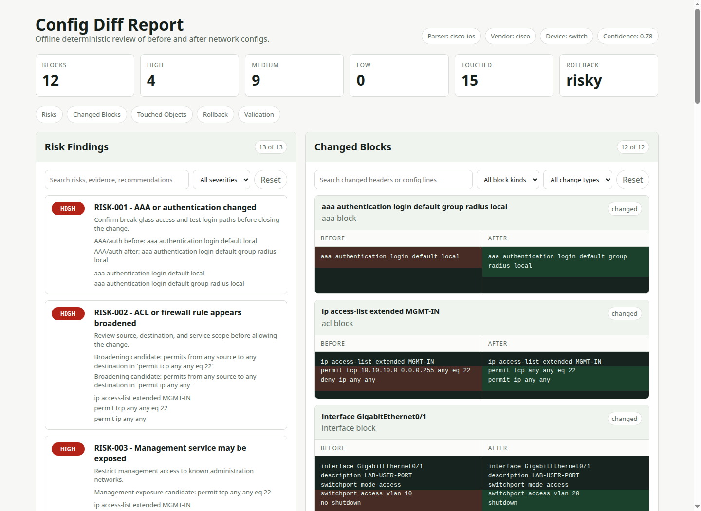

# Cutsheet

[](https://github.com/solomonneas/cutsheet/actions/workflows/ci.yml)
[](https://go.dev/doc/go1.22)
[](#privacy-model)
[](#supported-input-types)
[](schema/diff-analysis-v1.schema.json)

`cutsheet` is a network change intelligence toolkit. Today it ships an offline CLI for reviewing before and after network device configuration changes. It parses device configs into deterministic facts, compares the normalized state, then writes operator-ready reports that explain what changed, what is risky, and how to validate or roll back the change.

It is built for change review workflows where configs may contain sensitive infrastructure details. Files stay local, analysis is deterministic, and generated reports are written with owner-only permissions where the operating system supports them.

## Highlights

- Offline by default: no API calls, no telemetry, and no controller login.
- Deterministic analysis: structured facts come before human-readable reports.
- Multi-vendor parser paths for Cisco IOS/IOS XE, Juniper Junos, Fortinet FortiOS, Palo Alto PAN-OS, Ubiquiti EdgeSwitch, Ubiquiti EdgeOS/VyOS, UniFi controller JSON, and generic text configs.
- Practical risk findings for routes, ACLs, VLANs, trunks, Layer 2 protections, NAT, VPNs, AAA, management access, and monitoring.
- Report bundles designed for operators, reviewers, and stakeholders, including a local HTML view for browser-based review.

## Quick Start

Build the CLI from the project root:

```bash
make build
```

Run an explanation against two config files:

```bash
cutsheet explain \
  --before ./before.cfg \
  --after ./after.cfg \
  --vendor auto \
  --out ./reports/change-001
```

Generate the included lab-safe sample report:

```bash
make sample-report
```

Open `./reports/change-001/report.html` in a browser to review the generated HTML diff report.

The output directory contains:

| File | Purpose |
| --- | --- |
| `diff-analysis.json` | Structured deterministic analysis facts |
| `change-summary.md` | Human-readable summary of the change |
| `risk-analysis.md` | Risk findings and supporting evidence |
| `touched-objects.md` | Interfaces, VLANs, routes, and other affected objects |
| `rollback-plan.md` | Before-config facts and candidate rollback guidance |
| `validation-plan.md` | Checks to run before and after the change |
| `operator-checklist.md` | Step-by-step operator checklist |
| `stakeholder-brief.md` | Short non-technical impact summary |
| `report.html` | Local browser view with filters, summary metrics, risk findings, touched objects, rollback guidance, validation steps, and side-by-side changed blocks |

`reports/` is gitignored because report bundles can contain sensitive configuration snippets.



## Privacy Model

- Configs are read from local files only.
- No network access is required.
- Configs are not sent to external APIs.
- The v1 explanation layer is deterministic and offline.
- Output files may contain sensitive config snippets, so report files are written with owner-only file permissions where the operating system supports them.

## Supported Input Types

Use `--vendor auto` to select a parser when the config has strong vendor signals. If no confident match exists, the CLI falls back to `generic`.

| Parser path | Vendor modes | Input shape | Notes |
| --- | --- | --- | --- |
| Generic | `auto`, `generic` | Plain text | Baseline section and line diffing for unsupported vendors |
| Cisco IOS/IOS XE | `cisco-ios`, `ios`, `ios-xe`, `cisco` | CLI text | Includes Catalyst-oriented Layer 2 switching semantics |
| Ubiquiti EdgeSwitch | `ubiquiti`, `edgeswitch`, `ubiquiti-edgeswitch`, `ubiquitios`, `edgeswitch-cli` | CLI text | Uses IOS-style parsing with EdgeSwitch detection |
| Ubiquiti EdgeOS/VyOS | `edgeos`, `vyos`, `ubiquiti-gateway`, `usg`, `udm`, `edgerouter` | `set` and `delete` command text | Targets gateway configs from `show configuration commands` |
| Palo Alto PAN-OS | `paloalto`, `palo-alto`, `panos`, `pan-os`, `pan` | `set` command text | Targets set-style PAN-OS configs |
| Juniper Junos | `juniper`, `junos` | `set` and `delete` command text | Initial deterministic Junos parser path |
| Fortinet FortiGate/FortiOS | `fortinet`, `fortigate`, `fortios` | `config` and `edit` block text | Initial deterministic FortiOS parser path |
| UniFi Network controller | `unifi`, `unifi-json`, `unifi-controller` | JSON export | Flattens JSON into stable pseudo-lines and readable CLI-equivalent lines |

UniFi controller configs are JSON rather than line-oriented CLI text. The JSON parser flattens the export into deterministic pseudo-lines and emits CLI-equivalent readable lines so the same risk findings apply. The privacy model is unchanged: configs are read from local files only, with no controller API access.

Supported deterministic extraction includes:

- added, removed, and changed config blocks
- interfaces
- VLANs and trunk/access VLAN references
- Layer 2 switching semantics for Catalyst-style switches: switchport mode, trunk scope, native VLAN, spanning-tree mode, root/priority, PortFast, BPDU guard, EtherChannel/port-channel, VTP, and storm-control
- static routes and default routes
- route next-hop changes where detectable
- ACL/firewall-style permit and deny rules, including first-pass action/protocol/source/destination/service extraction
- NAT-like objects and lines
- VPN/tunnel/crypto-like objects and lines
- management-plane access such as SSH, SNMP, HTTP, and line access
- AAA/authentication, local users, RADIUS, and TACACS-like lines
- logging, SNMP, NTP, and DNS lines

## Risk Findings

The v1 risk engine flags at least:

- default route changes
- route removals
- ACL/firewall broadening such as `any any`, broad CIDRs, and exposed management ports
- VLAN removals and interface VLAN changes
- trunk allowed VLAN changes
- Layer 2 switching changes: switchport mode flips, trunks carrying all VLANs, native VLAN changes, spanning-tree mode and root/priority changes, reduced BPDU protection or PortFast on trunks, EtherChannel membership/mode changes, VTP mode/domain changes, and storm-control reductions
- shutdown/no shutdown changes
- NAT changes
- VPN peer/tunnel changes
- AAA/auth changes
- management access changes such as SSH/SNMP/HTTP
- logging/monitoring removal

## Parser Architecture

The parser layer is separated from analysis and reporting:

| Layer | Role |
| --- | --- |
| Parser | Normalizes text, groups sections and blocks, and detects generic platform signals |
| Analyzer | Diffs normalized blocks, extracts touched objects, assigns risks, and builds rollback facts |
| Explanation provider | Renders reports from deterministic facts |

The first explanation provider is offline and deterministic. A future provider can use the same `ExplanationProvider` interface, but deterministic analysis remains the source of truth.

## Current Limitations

- Cisco IOS/IOS XE support is an initial deterministic parser path built on IOS-style section parsing and heuristics, not full semantic emulation of every platform feature.
- Ubiquiti EdgeSwitch/UbiquitiOS support rides the IOS-style parse path and is labeled `ubiquiti`; EdgeSwitch-native VLAN forms such as `vlan participation` are recognized for detection but do not yet produce typed VLAN findings.
- EdgeOS/VyOS support is an initial deterministic parser path for `set`/`delete` style gateway configs. Curly-brace hierarchical form is not yet parsed, and interface `disable` toggles are not yet flagged.
- Junos support is an initial deterministic parser path for `set`/`delete` style configs, not full semantic emulation of every platform feature.
- Palo Alto PAN-OS support is an initial deterministic parser path for set-style configuration form. XML exports, Panorama device-group/template hierarchy, and multi-vsys are out of scope.
- UniFi controller support reads JSON exports from common single-site collections such as `networkconf`, `port_overrides`, `firewallrule`, and `routing`. XML or `.unf` backups, multi-site exports, and live controller API fetches are out of scope.
- Fortinet support is an initial deterministic parser path for FortiOS `config`/`edit` blocks, not full semantic emulation of every platform feature.
- The parser uses deterministic heuristics and may miss vendor-specific semantics.
- Report prose is practical guidance, not a replacement for device-specific command validation.
- Rollback snippets preserve before-config facts and separate exact reapply snippets from candidate commands. Candidate commands are not authoritative and may require operator review.

## Roadmap

Future parser packages should implement the same parser contract and emit the same stable v1 analysis shape where possible.

Parser roadmap:

- deeper Cisco IOS and IOS XE semantics
- deeper Juniper Junos semantics
- deeper Fortinet FortiGate semantics
- deeper Palo Alto PAN-OS semantics
- pfSense
- MikroTik RouterOS

Near-term improvements:

- broader JSON Schema validation coverage for clean/no-change outputs and future parser variants
- vendor-specific rollback command generation
- polished HTML frontend design pass, potentially generated with Opus and kept offline/static
- richer ACL and firewall rule normalization across vendor-specific syntaxes
- route table intent summaries
- optional local-only or explicitly configured explanation providers

## Development

Run tests:

```bash
make test
```

Run vet:

```bash
make vet
```

Build the binary:

```bash
make build
```

Regenerate the README screenshot from the lab-safe HTML report:

```bash
make screenshot
```

The screenshot target uses `google-chrome` in headless mode by default. Override the browser binary when needed:

```bash
make screenshot CHROME=chromium
```

The test suite includes compact JSON golden summaries for Cisco IOS-style, Junos-style, and other sample configs under `testdata/golden/`. Update those fixtures only when an intentional parser, risk, or output-shape change affects the expected summary.
